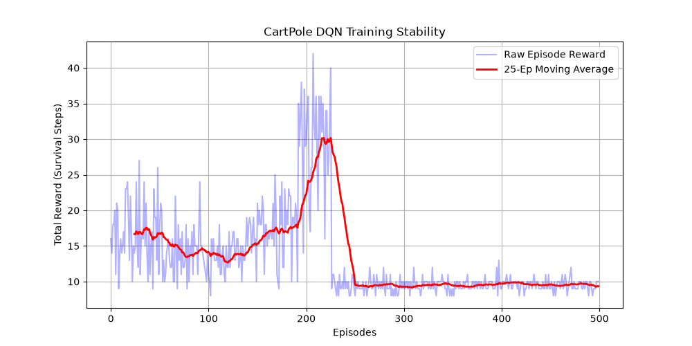
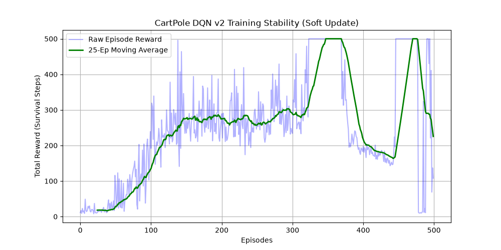

# Reinforcement Learning Literacy: From Tabular Methods to Deep Q-Networks

This repository contains a comparative study on Reinforcement Learning (RL) architectures, focusing on the transition from classical tabular methods to modern Deep Reinforcement Learning. 

The project is structured as an engineering-oriented experiment, analyzing exploration/exploitation trade-offs, target-network stability, and practical approaches to improving DQN training stability.

---

## 📁 Repository Structure

```text
rl-study/
├── 01_tabular_rl/
│   └── taxi_q_learning.py      # Classical Q-Learning from scratch (No RL libraries)
├── 02_deep_rl/
│   ├── cartpole_dqn.py         # Deep Q-Network baseline (Hard updates - Policy collapse)
│   └── cartpole_dqn_v2.py      # Stabilized DQN (Soft updates, optimized buffer & LR)
└── plots/
    ├── taxi_rewards.png        # Convergence curve for Tabular RL
    ├── cartpole_rewards.png    # Visual proof of Catastrophic Forgetting
    └── cartpole_rewards_v2.png # Visual proof of Soft Update stabilization
```

---

## 🔬 Experiment Case Studies & Implementations

### 1. Tabular RL: Taxi-v4 
*   **Objective:** Train a taxi agent to pick up a passenger and drop them off at a destination using the shortest path without hitting walls.
*   **Methodology:** Implemented a full **Q-Table (500 states x 6 actions)** entirely from scratch using pure Python/NumPy and the temporal difference **Bellman Equation** update loop. Used exponential $\epsilon$-greedy decay to smoothly transition from pure exploration ($\epsilon=1.0$) to exploitation.
*   **Outcome:** Highly stable convergence. The agent learned the exact penaly-minimization path, improving the average total reward from approximately -285.66 to around -7.32, indicating that the agent learned increasingly efficient routes and reduced unnecessary penalties.

### 2. Deep RL Baseline: CartPole-v1 (DQN v1 - Training Instability)
* **Objective:** Balance a pole on a moving cart using continuous sensory inputs (cart position, velocity, pole angle, and angular velocity).
* **Architecture:** Implemented a PyTorch-based Multi-Layer Perceptron (MLP) with an Experience Replay Buffer and **Hard Target Network Updates**, where the target network parameters were synchronized every 1000 steps.
* **Analysis:** Around episode 220, as exploration decreased ($\epsilon \to 0.01$), the agent experienced a severe and persistent drop in performance. The observed instability motivated further investigation into replay distribution, target-network updates, and optimization stability.

### 3. Stabilized Deep RL: CartPole-v1 (DQN v2 - Polyak Averaging)
*   **Objective:** Stabilize the deep function approximator against memory poisoning and target variance.
*   **Engineering Adjustments (The Fixes):**
    1.  **Polyak Averaging (Soft Target Updates):** Replaced hard kopyalama intervals with smooth target network parameter updates on every single optimization step using $\theta_{\text{target}} \leftarrow \tau \theta_{\text{online}} + (1 - \tau) \theta_{\text{target}}$ where $\tau = 0.01$.
    2.  **Learning Rate Reduction:** Dropped $\alpha$ from `0.001` to `0.00025` to enforce safer gradient steps.
    3.  **Buffer Capacity Scaling:** Expanded the `ReplayBuffer` to `50,000` transitions to retain valuable historical experiences far longer.
*   **Outcome:** The modified configuration demonstrated substantially improved training stability. The agent successfully resisted permanent failure, maintained a high-performance plateau for hundreds of episodes, and **frequently reached the maximum environment cap of 500 survival steps**.

---

## 📊 Empirical Results & Learning Curves

### Tabular RL Convergence (`taxi_rewards.png`)
The 50-episode moving average curve shows a clear upward convergence trend toward higher-performing policies, verifying that the domino-effect reward propagation successfully mapped out the gridworld topology.

### Deep RL Multi-Version Comparison

| DQN v1: Baseline Mismatch (`cartpole_rewards.png`) | DQN v2: Soft Update Stabilized (`cartpole_rewards_v2.png`) |
| :---: | :---: |
|  |  |
| *Observation: Sudden, catastrophic dive right after hitting a performance peak at episode 220, flattening out permanently.* | *Observation: Continuous learning, robust stabilization, policy oscillation recovery, and multiple perfect 500-score streaks.* |

---

